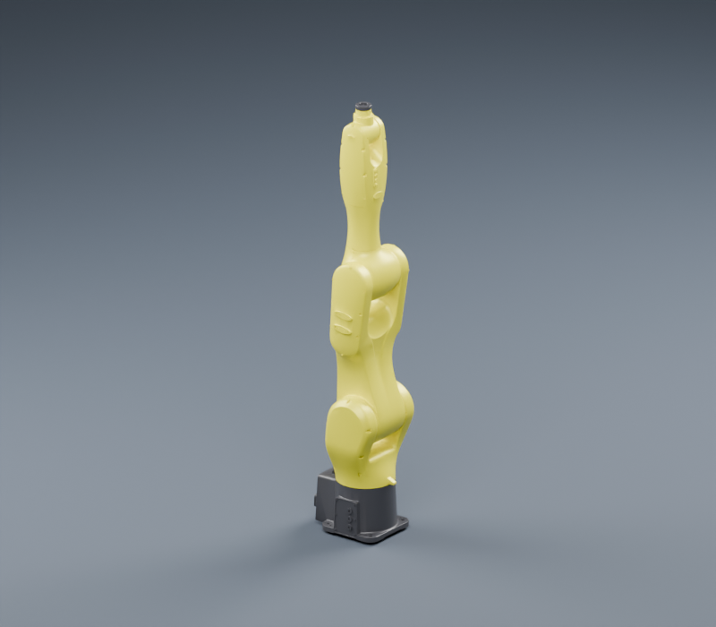
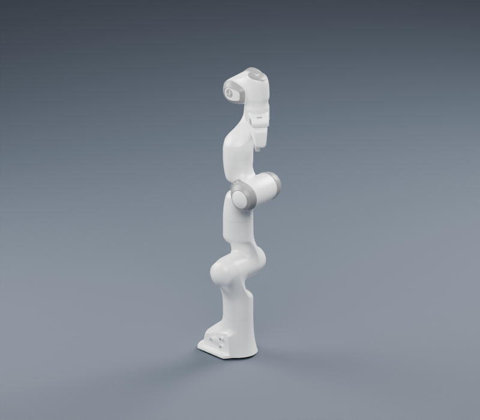
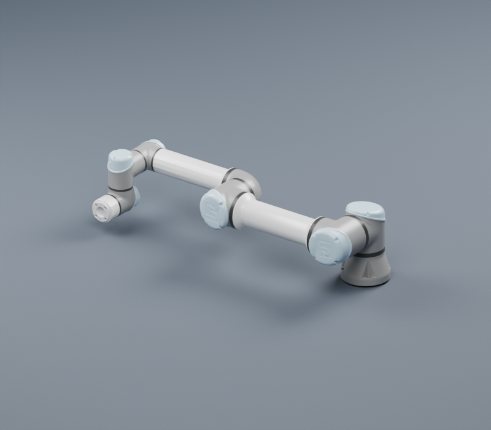
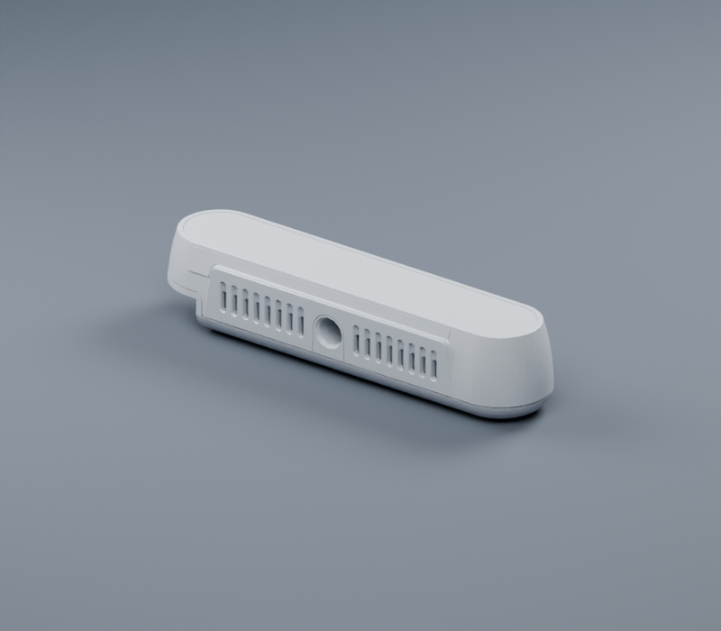
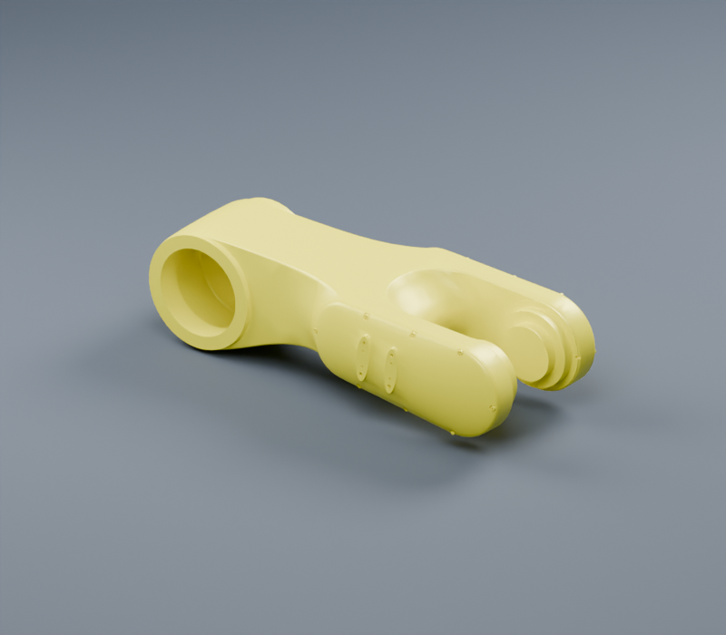

# AssetsModel

Portable URDF assets for robot planning, simulation, and visualization.

**67 URDF variants · 10 robot vendors · 783 GLB meshes · 405 optional STL meshes**

[Model catalog](docs/CATALOG.md) · [Asset layout](docs/ASSET_LAYOUT.md) · [Before / after viewer](docs/preview.html) · [GLB conversion report](docs/GLB_REPORT.md) · [工具使用说明](docs/MESH_WORKFLOW.md)

All URDFs now reference **GLB meshes in their model directories**. Visual and collision resources use format subdirectories such as `Visual/glb/`, `Visual/stl/`, `Collision/glb/` and `Collision/stl/`; cameras and tools use `meshes/glb/` and `meshes/stl/`. **DAE files and the duplicate top-level GLB tree have been removed.** GLBs occupy **311.2 MiB**; retained STL alternatives occupy **245.3 MiB**. Copy a model directory, or export only its GLB runtime resources using the [workflow](docs/MESH_WORKFLOW.md).

| AE AIR10-1210 | Franka Panda | Universal Robots UR5e |
| :---: | :---: | :---: |
|  |  |  |

Previews use the supplied materials and zero joint positions. Meshes retain their original model coordinates and units.

## Find a model

| Category | URDF variants | Directory convention |
| --- | ---: | --- |
| Industrial robots and arm/hand variants | 56 | `RobotModel/<Vendor>/<Model>/` |
| RealSense cameras and plug variants | 10 | `CameraModel/RealSense/<Model>/` |
| Robotiq 2F85 gripper | 1 | `ToolModel/Robotiq2F85/` |

The [complete catalog](docs/CATALOG.md) links every URDF and lists its link and actuated-joint counts. Mimic joints are excluded from the actuated-joint count.

## Use an asset

Pass the URDF path to your robotics application. Keep the URDF and its mesh directories together when copying a model.

```text
RobotModel/UniversalRobots/UR5e/UR5e.urdf
CameraModel/RealSense/RealSense_D405/RealSense_D405_and_plug.urdf
ToolModel/Robotiq2F85/Robotiq2F85.urdf
```

All resource references are relative to the URDF directory and point to `glb/` subdirectories. Existing `Visual` and `Collision` capitalization is retained; format directory names are lowercase. STL alternatives are optional and are not referenced by the default URDFs. Compose robot/tool/camera assemblies in the consuming project.

## Mesh quality

The September 2026 optimization reduced mesh data from **1,256.9 MiB to 618.5 MiB (50.8%)**, and triangle count from **20,608,370 to 10,407,054 (49.5%)**.

- Simplified 161 dense meshes with measured geometry checks.
- Cleaned 5,015 additional zero-area triangles across 71 meshes.
- Preserved material groups and added smooth normals with 30° hard edges to processed DAE surfaces.
- Retained original geometry when simplification failed the acceptance checks.

| D415: 425,160 → 20,000 triangles | AE Link2: 330,132 → 33,012 triangles |
| :---: | :---: |
|  |  |

Use the [interactive comparison](docs/preview.html) for original/optimized views, or the [report](docs/OPTIMIZATION_REPORT.md) for per-file counts and measured limits. Statistics cover mesh files, excluding Git history and documentation.

## Validate and maintain

Basic checks require Python 3.10+ and no third-party packages:

```bash
python3 scripts/validate_assets.py --meshes --layout --json /tmp/assets-validation.json
python3 -m unittest discover -s tests -v
```

Geometry audit, simplification, and rendering use the optional [mesh dependencies](requirements-mesh.txt); simplification/rendering also require Blender. See the [workflow](docs/MESH_WORKFLOW.md) for commands, backup behavior, and acceptance thresholds.

The supplied models are not all ready for dynamic simulation: the validator reports missing inertial data and zero effort/velocity limits separately. Review these parameters for your application. Geometric sampling is not a certified collision clearance bound.

## Contribute

1. Follow the category/vendor/model layout and keep each model directory self-contained.
2. Use relative GLB resource paths and format subdirectories; retain optional STL files under `stl/`. Convert incoming DAE files before adding assets.
3. Preserve link frames, units, material assignments, and meaningful mechanical details.
4. Run validation and the geometry audit; add the model to the generated catalog.
5. Document physical parameter sources and include a preview when available.
