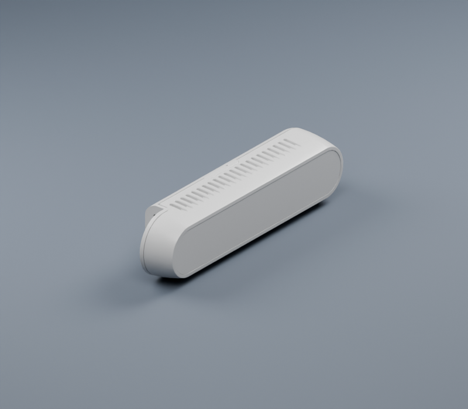
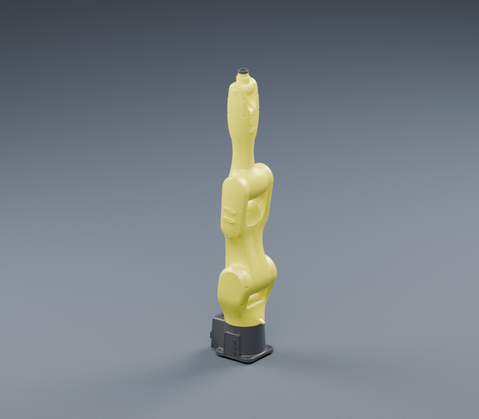

# GLB 转换与进一步优化报告

全部 **783 个 DAE/STL 网格**已经转换为 GLB，**67 个 URDF** 统一引用模型内的 `glb/` 子目录。可直接从[模型目录](CATALOG.md)复制需要的模型。

后续目录整理已移除全部 378 个 DAE 和顶层重复的 GLB 目录。原有 405 个 STL 保留在 `Visual/stl/`、`Collision/stl/` 或 `meshes/stl/`；GLB 位于同级 `glb/`。当前 GLB 与 STL 合计 **556.4 MiB**，其中 GLB 为 311.2 MiB。下面的 DAE/STL 体积是历史阶段数据，现行结构见[资源布局](ASSET_LAYOUT.md)。

## 体积与几何

| 阶段 | 网格体积 | 三角形数 |
| --- | ---: | ---: |
| 首轮优化前 | 1,256.9 MiB | 20,608,370 |
| 完成减面及退化面清理的 DAE/STL | 618.5 MiB | 10,407,054 |
| 当前 GLB 主资源 | **311.2 MiB** | **10,407,054** |

GLB 相比优化后的源格式再减少 **49.7%**，相比最初资源减少约 **75.2%**。其中碰撞资源由 **234.5 MiB 降至 58.0 MiB**。本轮转换保留全部有效三角形；减面记录见[上一轮报告](OPTIMIZATION_REPORT.md)。

GLB 并非每个文件都更小：213 个较小资源由于容器元数据或新增外观法线而变大，整套资源的合计体积仍明显下降。逐文件体积、哈希、面数及当前路径见 [`glb-manifest.json`](glb-manifest.json)。其中 `source` 字段记录历史输入路径。

## 本轮实际处理

- 合并完全一致的位置及法线属性，避免 STL 的逐三角形重复顶点占用；不同硬边法线仍保留独立顶点。
- 索引范围允许时使用 16 位整数，大网格自动使用 32 位，避免索引溢出。
- 碰撞资源只保存几何和索引，省略渲染法线与材质；被外观引用的同一资源仍保留显示属性。
- 为 STL 外观生成 30° 硬边阈值的平滑角点法线。平滑只沿局部流形边传播，机械棱边保留，顶点位置不变。
- 保留 DAE 原角点法线和材质分组。修复 ABB IRB1200_5_90 外观 Link2 中发现的两个零法线，使用对应三角形的几何法线补齐。
- 将 DAE 的层级变换、缩放和单位烘焙到网格，使用逆转置变换法线。上一轮因场景缩放而跳过减面的 KUKA KR210_L150 Link2 也已完成 GLB 转换。
- 19 个文件中的 CAD 辅助线保存在可选第二场景；默认场景只包含表面，使 URDF 加载器能够直接装配模型。
- 同目录 DAE/STL 重名时输出 `Link.glb` 和 `Link.stl.glb`，避免资源覆盖。所有 URDF 的引用同步更新。

没有使用 Draco、Meshopt 或量化扩展，资源没有外部贴图依赖。原 DAE 只有纯色材质；两处全白顶点颜色是恒等乘数，转换时省略。未来导入带纹理或非白顶点颜色的 DAE 会明确报错，避免静默丢失外观。

## 验证范围

| 检查 | 结果 |
| --- | --- |
| 67 个 URDF 的路径、树结构和数值 | 0 错误 |
| Khronos 官方 glTF-Validator 2.0.0-dev.3.10 | **783 个文件通过，0 错误、0 警告** |
| 783 个 GLB 的位置、索引和几何审计 | 0 错误、0 退化面 |
| 转换前后逐三角形角点比较 | 最大位置误差 **4.45 × 10⁻⁸ m** |
| 全部 67 个模型、每个 3 组关节姿态 | **201 组通过** |
| 关节及链接变换 | 在绝对容差 10⁻¹² 内一致 |
| 外观和碰撞表面总面数 | 一致 |
| 外观和碰撞装配包围盒 | 在绝对容差 10⁻⁶ m 内一致 |
| 自动化回归测试 | 23 项通过 |

姿态检查覆盖零姿态，以及有限位关节范围的 25% 和 75% 位置；使用 trimesh 4.12.2 / yourdfpy 0.0.60。转换只替换 URDF 网格引用，链接、关节、origin、scale、限位和惯量字段通过结构对比。

源库已有的 235 条惯量缺失或零运动限位警告仍保留，未编造动力学参数。这些警告不影响几何和路径检查通过。详见[当前 URDF 和目录校验](asset-validation.json)、[GLB 网格审计](glb-mesh-audit.json)、[转换时多姿态对比](glb-loader-validation.json)。目录迁移后的全部 1,188 个 GLB/STL 也通过[几何审计](mesh-audit.json)，迁移前后再次完成 [201 组姿态对比](layout-validation.json)。

完整格式检查使用 [Khronos 官方校验器](https://github.com/KhronosGroup/glTF-Validator)，覆盖 glTF 结构和二进制访问器。逐文件结果与对应内容哈希见 [GLB 格式校验报告](glb-format-validation.json)，该检查已接入 CI。

## 外观和加载约定

DAE 的漫反射颜色、透明度、发光颜色及材质分组映射到 glTF 核心 PBR 材质；Phong 高光通过粗糙度近似表达。不同渲染器的光照和色彩管理会影响最终图像，不能保证与 COLLADA 渲染逐像素相同。STL 本身没有材质，装配外观仍依赖 URDF 的颜色设置。

网格保留 URDF 的局部坐标和米制尺寸。glTF 采用右手坐标、米制和 Y 向上的约定；单独打开机器人零件时，查看器的默认相机可能与机器人查看器不同，加载配套 URDF 时不要再额外旋转网格。[Khronos glTF 2.0 规范](https://registry.khronos.org/glTF/specs/2.0/glTF-2.0.html)

已验证上述 Python 加载器；其他仿真或机器人应用的 GLB 支持取决于实际加载链及版本。需要 STL 的应用可使用 `stl/` 中的可选资源；默认 URDF 统一使用 GLB。

| GLB 相机装配预览 | GLB 机器人装配预览 |
| :---: | :---: |
|  |  |

## 本机加载测量

在同一台机器、文件系统缓存已预热的条件下，使用 `trimesh.load_scene(process=False)` 预热一次，再取 5 次加载的中位数。计时包含文件解析和场景构造，不代表整个仿真系统的帧率或冷启动性能。

| 资源 | 源格式 | GLB | 加速比 |
| --- | ---: | ---: | ---: |
| RealSense D415 外观 | 1.352 ms | 0.591 ms | 2.29× |
| AE AIR10_1210 外观 Link2 | 32.049 ms | 0.642 ms | 49.95× |
| Hans E10 外观 Link6 | 35.118 ms | 0.669 ms | 52.53× |
| AE AIR35_1700 碰撞 Link1 | 8.089 ms | 1.014 ms | 7.97× |

原始计时见 [glb-loading-benchmark.json](glb-loading-benchmark.json)。

## 后续优化位置

1. **按需打包已支持。** 库中保留了 21 个暂未被 URDF 引用的 GLB，合计约 7.84 MiB。`export_assets.py --referenced-only` 可在干净目录仅导出选定模型实际需要的 GLB 和 URDF；UR5e 的独立打包与资源引用已通过检查。
2. **高面数碰撞资源仍有潜力。** AE AIR35_1700 碰撞 Link1 为 165,329 面，AIR12_940 碰撞 Link1 为 160,436 面。继续压缩几何宜先按独立零件及机械特征分块，再制作专用碰撞近似或 LOD，并验证间隙、孔洞和接触需求。上一轮有 18 个密集网格未通过减面验收，本轮保留其表面。
3. **按渲染距离提供外观 LOD。** 小螺钉和内部细节适合在远景隐藏；近景主资产继续保留。模型级 LOD 需要消费端选择机制，当前通用 URDF 只使用一套外观。
4. **动力学参数需要真实来源。** 惯量、质量和力矩/速度限位适合按厂商资料补齐，无法从外观转换可靠推导。

转换新资源、按需打包和校验的命令见[工作流程](MESH_WORKFLOW.md)，模型入口见[模型目录](CATALOG.md)。
