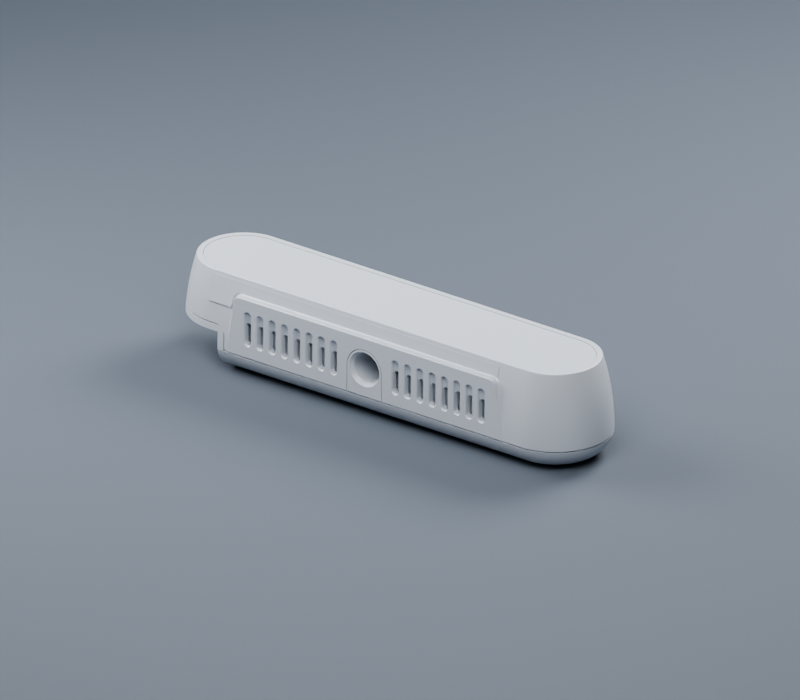
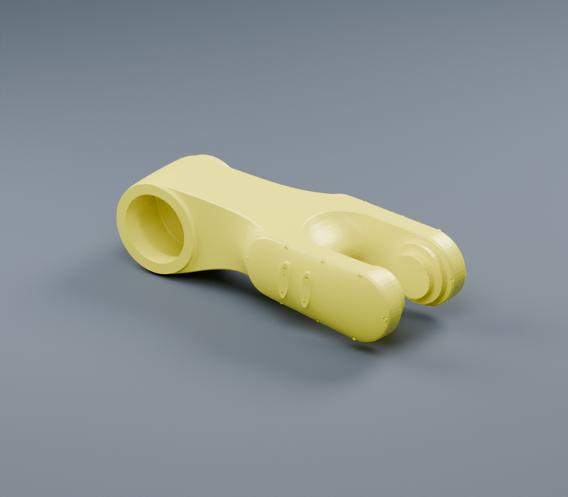

# 整体优化记录

> 本页记录首轮 DAE/STL 减面结果。DAE 现已移除，表格保留历史文件名与体积，链接指向当前对应的 GLB 或 STL；现行目录见 [资源布局](ASSET_LAYOUT.md)。

基线：`da38677` · 日期：2026-09-05。统计对象为仓库内的 783 个 STL/DAE 文件。

## 结果

| 指标 | 优化前 | 优化后 |
| --- | ---: | ---: |
| 网格文件体积 | 1,256.93 MiB | 618.52 MiB |
| 三角形数量 | 20,608,370 | 10,407,054 |
| URDF 变体 | 67 | 67 |
| 网格资源 | 783 | 783 |

共修改 232 个网格，其中 161 个进行了减面或重复面清理，另有 71 个仅清理零面积三角形。网格体积减少 **638.41 MiB（50.79%）**，三角形数量减少 **49.50%**。专项清理去除了 5,015 个零面积三角形，最终审计未检出此类退化面。

## 典型资源

| 资源 | 原始面数 | 最终面数 | 减少 |
| --- | ---: | ---: | ---: |
| [CameraModel/RealSense/RealSense_D415/meshes/d415.stl](../CameraModel/RealSense/RealSense_D415/meshes/stl/d415.stl) | 425,160 | 20,000 | 95.3% |
| [RobotModel/AE/AIR10_1210/Visual/Link2.dae](../RobotModel/AE/AIR10_1210/Visual/glb/Link2.glb) | 330,132 | 33,012 | 90.0% |
| [RobotModel/AE/AIR35_1700/Visual/Link1.dae](../RobotModel/AE/AIR35_1700/Visual/glb/Link1.glb) | 472,370 | 94,474 | 80.0% |
| [RobotModel/AE/AIR35_1700/Collision/Link1.stl](../RobotModel/AE/AIR35_1700/Collision/stl/Link1.stl) | 472,370 | 165,329 | 65.0% |
| [RobotModel/Hans/E10/Visual/Link6.dae](../RobotModel/Hans/E10/Visual/glb/Link6.glb) | 381,329 | 38,131 | 90.0% |
| [ToolModel/Robotiq2F85/meshes/robotiq_85_base_link_fine.stl](../ToolModel/Robotiq2F85/meshes/stl/robotiq_85_base_link_fine.stl) | 40,112 | 20,000 | 50.1% |

## 本机加载对比

使用 `trimesh.load_scene(process=False)`，每个版本预热一次，再取 3 次加载的中位数。以下为同机热缓存结果，衡量网格解析/场景构建，不代表完整仿真帧率。

| 资源 | 原始加载 | 优化后加载 | 加速 |
| --- | ---: | ---: | ---: |
| CameraModel/RealSense/RealSense_D415/meshes/d415.stl | 12.5 ms | 1.0 ms | 12.3× |
| RobotModel/AE/AIR10_1210/Visual/Link2.dae | 484.1 ms | 27.6 ms | 17.6× |
| RobotModel/Hans/E10/Visual/Link6.dae | 515.8 ms | 33.6 ms | 15.4× |

[测量记录](loading-benchmark.json)

## 外观对比

[打开交互式滑块对比](preview.html)。渲染使用真实网格、相同光照和相机；优化后的 DAE 按 30° 保留硬边并重建平滑法线。

| 模型 | 原始 | 优化后 |
| --- | --- | --- |
| D415 |  |  |
| AE Link2 |  |  |

## 模型修复

- `PandaHand.urdf`：将不存在的 Finger 资源改为现有左右手指资源，为孤立的 `ee_link` 添加固定连接，并将右指运动轴改为负 Y。`ee_link` 定义在夹爪安装法兰，零位姿固定于 `base_link`。
- `PandaHand.urdf` 与 `PandaWithHand.urdf`：移除左右各 40 mm 的初始关节偏移。两指现在从闭合位置出发，独立关节行程 0–40 mm 对应两指参考框间距 0–80 mm。该修正依据 [Franka 官方 hand 描述](https://github.com/frankarobotics/franka_ros/blob/develop/franka_description/robots/common/franka_hand.xacro) 的关节原点与相反运动轴。
- `Hans/E05.urdf`：将无法解析的 `0.156.5` 改为 `0.1565` m。这是格式推断；仓库未提供可独立核验该尺寸的厂家来源。

## 验证结果与适用范围

- 全部 67 个 URDF、783 个网格通过结构与文件校验，错误数为 0。
- 全部 783 个网格已重新加载，顶点、三角形索引有效，审计检测到的零面积三角形为 0。
- 15 项回归测试覆盖链接与 mimic 环路、资源路径、数值异常、Panda 对称开合、丢失独立零件、表面偏移、小三角形距离精度、多材质 DAE 与辅助线段的序列化，以及零面积清理。
- 已使用 yourdfpy 0.0.60 加载全部 67 个 URDF 的外观和碰撞网格，并计算零位姿变换；详细记录见 [加载结果](loader-validation.json)。
- 235 条动力学准备度警告仍如实记录：部分带几何的链接缺少惯量，部分关节 effort / velocity 为零。未补造物理参数。
- 减面验收检查连通分量、边界边、非流形边、包围盒、面积、封闭网格体积及双向表面采样。外观采样偏差上限为 0.5 mm，碰撞为 0.25 mm，小零件按对角线进一步收紧。误差基于采样，不是严格全表面上界；简化碰撞网格不保证处处包住原表面。

18 个资源未获得同时满足几何和体积条件的候选，保留原文件；KUKA KR210_L150 的 Visual/Link2.dae 含非单位场景缩放，本次保留。保留这些资源的原因和各轮候选的检查结果均记录在 JSON 中。

## 工具与明细

[复现流程](MESH_WORKFLOW.md) · [完整优化指标](mesh-optimization.json) · [几何审计](mesh-audit.json) · [URDF 校验与警告](asset-validation.json) · [模型目录](CATALOG.md)

处理环境：Blender 5.2.1、Python 3.10.0、trimesh 4.12.2、pycollada 0.9.3。模型目录和引用路径保持可独立复制。原网格仍可由基线 Git 提交恢复；本次运行的阶段备份保存在 `/tmp/assetsmodel-*-20260905`，临时目录不作为长期存档。

## 修改文件

| 资源 | 原始面数 | 最终面数 | 原始 MiB | 最终 MiB |
| --- | ---: | ---: | ---: | ---: |
| [CameraModel/RealSense/RealSense_D415/meshes/d415.stl](../CameraModel/RealSense/RealSense_D415/meshes/stl/d415.stl) | 425,160 | 20,000 | 20.273 | 0.954 |
| [CameraModel/RealSense/RealSense_D435/meshes/d435.dae](../CameraModel/RealSense/RealSense_D435/meshes/glb/d435.glb) | 231,186 | 89,493 | 15.051 | 6.938 |
| [CameraModel/RealSense/RealSense_D436/meshes/d436.dae](../CameraModel/RealSense/RealSense_D436/meshes/glb/d436.glb) | 231,186 | 89,493 | 15.051 | 6.938 |
| [CameraModel/RealSense/RealSense_D455/meshes/d455.stl](../CameraModel/RealSense/RealSense_D455/meshes/stl/d455.stl) | 51,162 | 20,000 | 2.440 | 0.954 |
| [CameraModel/RealSense/RealSense_D585/meshes/d585.stl](../CameraModel/RealSense/RealSense_D585/meshes/stl/d585.stl) | 139,796 | 48,913 | 6.666 | 2.332 |
| [RobotModel/ABB/IRB1200_5_90/Collision/Link2.stl](../RobotModel/ABB/IRB1200_5_90/Collision/stl/Link2.stl) | 20,125 | 16,081 | 0.960 | 0.767 |
| [RobotModel/ABB/IRB1200_5_90/Collision/Link3.stl](../RobotModel/ABB/IRB1200_5_90/Collision/stl/Link3.stl) | 10,360 | 10,354 | 0.494 | 0.494 |
| [RobotModel/ABB/IRB1200_5_90/Collision/Link5.stl](../RobotModel/ABB/IRB1200_5_90/Collision/stl/Link5.stl) | 11,278 | 11,262 | 0.538 | 0.537 |
| [RobotModel/ABB/IRB1200_5_90/Visual/Link2.dae](../RobotModel/ABB/IRB1200_5_90/Visual/glb/Link2.glb) | 20,125 | 19,999 | 1.335 | 1.239 |
| [RobotModel/ABB/IRB1200_5_90/Visual/Link3.dae](../RobotModel/ABB/IRB1200_5_90/Visual/glb/Link3.glb) | 10,360 | 10,354 | 0.702 | 0.702 |
| [RobotModel/ABB/IRB1200_5_90/Visual/Link5.dae](../RobotModel/ABB/IRB1200_5_90/Visual/glb/Link5.glb) | 11,278 | 11,262 | 0.876 | 0.875 |
| [RobotModel/ABB/IRB1200_7_70/Collision/Link5.stl](../RobotModel/ABB/IRB1200_7_70/Collision/stl/Link5.stl) | 11,278 | 11,262 | 0.538 | 0.537 |
| [RobotModel/ABB/IRB1200_7_70/Visual/Link5.dae](../RobotModel/ABB/IRB1200_7_70/Visual/glb/Link5.glb) | 11,278 | 11,262 | 0.765 | 0.743 |
| [RobotModel/ABB/IRB1600_10_145/Collision/Link4.stl](../RobotModel/ABB/IRB1600_10_145/Collision/stl/Link4.stl) | 80,314 | 16,062 | 3.830 | 0.766 |
| [RobotModel/ABB/IRB1600_10_145/Visual/Link4.dae](../RobotModel/ABB/IRB1600_10_145/Visual/glb/Link4.glb) | 80,314 | 19,999 | 6.203 | 1.277 |
| [RobotModel/ABB/IRB2600_12_165/Collision/Link1.dae](../RobotModel/ABB/IRB2600_12_165/Collision/glb/Link1.glb) | 31,086 | 15,529 | 2.086 | 1.008 |
| [RobotModel/ABB/IRB2600_12_165/Collision/Link2.dae](../RobotModel/ABB/IRB2600_12_165/Collision/glb/Link2.glb) | 13,450 | 13,448 | 0.915 | 0.915 |
| [RobotModel/ABB/IRB2600_12_165/Collision/Link3.dae](../RobotModel/ABB/IRB2600_12_165/Collision/glb/Link3.glb) | 38,272 | 13,430 | 2.743 | 0.892 |
| [RobotModel/ABB/IRB2600_12_165/Collision/Link4.dae](../RobotModel/ABB/IRB2600_12_165/Collision/glb/Link4.glb) | 108,480 | 54,282 | 8.364 | 3.506 |
| [RobotModel/ABB/IRB2600_12_165/Collision/Link6.dae](../RobotModel/ABB/IRB2600_12_165/Collision/glb/Link6.glb) | 1,484 | 1,482 | 0.083 | 0.083 |
| [RobotModel/ABB/IRB2600_12_165/Visual/Link1.dae](../RobotModel/ABB/IRB2600_12_165/Visual/glb/Link1.glb) | 31,086 | 19,999 | 2.086 | 1.276 |
| [RobotModel/ABB/IRB2600_12_165/Visual/Link2.dae](../RobotModel/ABB/IRB2600_12_165/Visual/glb/Link2.glb) | 13,450 | 13,448 | 0.915 | 0.915 |
| [RobotModel/ABB/IRB2600_12_165/Visual/Link3.dae](../RobotModel/ABB/IRB2600_12_165/Visual/glb/Link3.glb) | 38,272 | 20,026 | 2.743 | 1.295 |
| [RobotModel/ABB/IRB2600_12_165/Visual/Link4.dae](../RobotModel/ABB/IRB2600_12_165/Visual/glb/Link4.glb) | 108,480 | 21,794 | 8.361 | 1.378 |
| [RobotModel/ABB/IRB2600_12_185/Collision/Link4.stl](../RobotModel/ABB/IRB2600_12_185/Collision/stl/Link4.stl) | 24,406 | 19,524 | 1.164 | 0.931 |
| [RobotModel/ABB/IRB2600_12_185/Visual/Link4.dae](../RobotModel/ABB/IRB2600_12_185/Visual/glb/Link4.glb) | 24,406 | 20,010 | 1.772 | 1.228 |
| [RobotModel/ABB/IRB4600_20_250/Collision/Link4.stl](../RobotModel/ABB/IRB4600_20_250/Collision/stl/Link4.stl) | 9,998 | 9,997 | 0.477 | 0.477 |
| [RobotModel/ABB/IRB4600_20_250/Visual/Link4.dae](../RobotModel/ABB/IRB4600_20_250/Visual/glb/Link4.glb) | 9,998 | 9,997 | 0.700 | 0.700 |
| [RobotModel/AE/AIR10_1210/Collision/BaseLink.stl](../RobotModel/AE/AIR10_1210/Collision/stl/BaseLink.stl) | 301,986 | 60,397 | 14.400 | 2.880 |
| [RobotModel/AE/AIR10_1210/Collision/Link1.stl](../RobotModel/AE/AIR10_1210/Collision/stl/Link1.stl) | 200,980 | 100,490 | 9.584 | 4.792 |
| [RobotModel/AE/AIR10_1210/Collision/Link2.stl](../RobotModel/AE/AIR10_1210/Collision/stl/Link2.stl) | 330,132 | 66,026 | 15.742 | 3.148 |
| [RobotModel/AE/AIR10_1210/Collision/Link3.stl](../RobotModel/AE/AIR10_1210/Collision/stl/Link3.stl) | 69,430 | 34,714 | 3.311 | 1.655 |
| [RobotModel/AE/AIR10_1210/Collision/Link4.stl](../RobotModel/AE/AIR10_1210/Collision/stl/Link4.stl) | 233,584 | 23,358 | 11.138 | 1.114 |
| [RobotModel/AE/AIR10_1210/Collision/Link5.stl](../RobotModel/AE/AIR10_1210/Collision/stl/Link5.stl) | 39,238 | 13,732 | 1.871 | 0.655 |
| [RobotModel/AE/AIR10_1210/Visual/BaseLink.dae](../RobotModel/AE/AIR10_1210/Visual/glb/BaseLink.glb) | 301,986 | 30,198 | 24.290 | 2.301 |
| [RobotModel/AE/AIR10_1210/Visual/Link1.dae](../RobotModel/AE/AIR10_1210/Visual/glb/Link1.glb) | 200,980 | 40,196 | 15.759 | 2.697 |
| [RobotModel/AE/AIR10_1210/Visual/Link2.dae](../RobotModel/AE/AIR10_1210/Visual/glb/Link2.glb) | 330,132 | 33,012 | 26.632 | 2.301 |
| [RobotModel/AE/AIR10_1210/Visual/Link3.dae](../RobotModel/AE/AIR10_1210/Visual/glb/Link3.glb) | 69,430 | 20,000 | 5.322 | 1.273 |
| [RobotModel/AE/AIR10_1210/Visual/Link4.dae](../RobotModel/AE/AIR10_1210/Visual/glb/Link4.glb) | 233,584 | 23,357 | 18.466 | 1.658 |
| [RobotModel/AE/AIR10_1210/Visual/Link5.dae](../RobotModel/AE/AIR10_1210/Visual/glb/Link5.glb) | 39,238 | 20,000 | 2.742 | 1.280 |
| [RobotModel/AE/AIR10_1720/Collision/BaseLink.stl](../RobotModel/AE/AIR10_1720/Collision/stl/BaseLink.stl) | 109,758 | 38,414 | 5.234 | 1.832 |
| [RobotModel/AE/AIR10_1720/Collision/Link1.stl](../RobotModel/AE/AIR10_1720/Collision/stl/Link1.stl) | 92,738 | 18,546 | 4.422 | 0.884 |
| [RobotModel/AE/AIR10_1720/Collision/Link2.stl](../RobotModel/AE/AIR10_1720/Collision/stl/Link2.stl) | 137,987 | 48,295 | 6.580 | 2.303 |
| [RobotModel/AE/AIR10_1720/Collision/Link3.stl](../RobotModel/AE/AIR10_1720/Collision/stl/Link3.stl) | 186,662 | 65,330 | 8.901 | 3.115 |
| [RobotModel/AE/AIR10_1720/Collision/Link4.stl](../RobotModel/AE/AIR10_1720/Collision/stl/Link4.stl) | 91,920 | 32,171 | 4.383 | 1.534 |
| [RobotModel/AE/AIR10_1720/Collision/Link5.stl](../RobotModel/AE/AIR10_1720/Collision/stl/Link5.stl) | 59,308 | 20,755 | 2.828 | 0.990 |
| [RobotModel/AE/AIR10_1720/Visual/BaseLink.dae](../RobotModel/AE/AIR10_1720/Visual/glb/BaseLink.glb) | 109,758 | 38,414 | 7.421 | 2.443 |
| [RobotModel/AE/AIR10_1720/Visual/Link1.dae](../RobotModel/AE/AIR10_1720/Visual/glb/Link1.glb) | 92,738 | 20,000 | 6.821 | 1.334 |
| [RobotModel/AE/AIR10_1720/Visual/Link2.dae](../RobotModel/AE/AIR10_1720/Visual/glb/Link2.glb) | 137,987 | 48,295 | 10.302 | 3.339 |
| [RobotModel/AE/AIR10_1720/Visual/Link3.dae](../RobotModel/AE/AIR10_1720/Visual/glb/Link3.glb) | 186,662 | 37,332 | 13.728 | 2.621 |
| [RobotModel/AE/AIR10_1720/Visual/Link4.dae](../RobotModel/AE/AIR10_1720/Visual/glb/Link4.glb) | 91,920 | 20,000 | 6.741 | 1.363 |
| [RobotModel/AE/AIR10_1720/Visual/Link5.dae](../RobotModel/AE/AIR10_1720/Visual/glb/Link5.glb) | 59,308 | 19,999 | 4.031 | 1.365 |
| [RobotModel/AE/AIR12_940/Collision/BaseLink.stl](../RobotModel/AE/AIR12_940/Collision/stl/BaseLink.stl) | 301,472 | 60,293 | 14.375 | 2.875 |
| [RobotModel/AE/AIR12_940/Collision/Link1.stl](../RobotModel/AE/AIR12_940/Collision/stl/Link1.stl) | 200,546 | 160,436 | 9.563 | 7.650 |
| [RobotModel/AE/AIR12_940/Collision/Link2.stl](../RobotModel/AE/AIR12_940/Collision/stl/Link2.stl) | 302,726 | 60,544 | 14.435 | 2.887 |
| [RobotModel/AE/AIR12_940/Collision/Link3.stl](../RobotModel/AE/AIR12_940/Collision/stl/Link3.stl) | 69,258 | 34,628 | 3.303 | 1.651 |
| [RobotModel/AE/AIR12_940/Collision/Link4.stl](../RobotModel/AE/AIR12_940/Collision/stl/Link4.stl) | 212,522 | 42,504 | 10.134 | 2.027 |
| [RobotModel/AE/AIR12_940/Collision/Link5.stl](../RobotModel/AE/AIR12_940/Collision/stl/Link5.stl) | 39,230 | 13,730 | 1.871 | 0.655 |
| [RobotModel/AE/AIR12_940/Visual/BaseLink.dae](../RobotModel/AE/AIR12_940/Visual/glb/BaseLink.glb) | 301,472 | 30,146 | 23.963 | 2.290 |
| [RobotModel/AE/AIR12_940/Visual/Link1.dae](../RobotModel/AE/AIR12_940/Visual/glb/Link1.glb) | 200,546 | 160,436 | 15.642 | 10.501 |
| [RobotModel/AE/AIR12_940/Visual/Link2.dae](../RobotModel/AE/AIR12_940/Visual/glb/Link2.glb) | 302,726 | 20,000 | 24.281 | 1.426 |
| [RobotModel/AE/AIR12_940/Visual/Link3.dae](../RobotModel/AE/AIR12_940/Visual/glb/Link3.glb) | 69,258 | 20,000 | 5.299 | 1.272 |
| [RobotModel/AE/AIR12_940/Visual/Link4.dae](../RobotModel/AE/AIR12_940/Visual/glb/Link4.glb) | 212,522 | 42,504 | 16.634 | 2.885 |
| [RobotModel/AE/AIR12_940/Visual/Link5.dae](../RobotModel/AE/AIR12_940/Visual/glb/Link5.glb) | 39,230 | 20,000 | 2.757 | 1.280 |
| [RobotModel/AE/AIR35_1700/Collision/BaseLink.stl](../RobotModel/AE/AIR35_1700/Collision/stl/BaseLink.stl) | 274,195 | 54,839 | 13.075 | 2.615 |
| [RobotModel/AE/AIR35_1700/Collision/Link1.stl](../RobotModel/AE/AIR35_1700/Collision/stl/Link1.stl) | 472,370 | 165,329 | 22.524 | 7.884 |
| [RobotModel/AE/AIR35_1700/Collision/Link2.stl](../RobotModel/AE/AIR35_1700/Collision/stl/Link2.stl) | 153,458 | 53,710 | 7.318 | 2.561 |
| [RobotModel/AE/AIR35_1700/Collision/Link3.stl](../RobotModel/AE/AIR35_1700/Collision/stl/Link3.stl) | 237,338 | 47,466 | 11.317 | 2.263 |
| [RobotModel/AE/AIR35_1700/Collision/Link5.stl](../RobotModel/AE/AIR35_1700/Collision/stl/Link5.stl) | 56,048 | 19,616 | 2.673 | 0.935 |
| [RobotModel/AE/AIR35_1700/Visual/BaseLink.dae](../RobotModel/AE/AIR35_1700/Visual/glb/BaseLink.glb) | 274,195 | 19,999 | 19.355 | 1.520 |
| [RobotModel/AE/AIR35_1700/Visual/Link1.dae](../RobotModel/AE/AIR35_1700/Visual/glb/Link1.glb) | 472,370 | 94,474 | 37.551 | 6.372 |
| [RobotModel/AE/AIR35_1700/Visual/Link2.dae](../RobotModel/AE/AIR35_1700/Visual/glb/Link2.glb) | 153,458 | 30,690 | 11.514 | 2.122 |
| [RobotModel/AE/AIR35_1700/Visual/Link3.dae](../RobotModel/AE/AIR35_1700/Visual/glb/Link3.glb) | 237,338 | 47,466 | 17.384 | 3.374 |
| [RobotModel/AE/AIR35_1700/Visual/Link5.dae](../RobotModel/AE/AIR35_1700/Visual/glb/Link5.glb) | 56,048 | 20,000 | 3.758 | 1.317 |
| [RobotModel/Agile/Diana_7/Collision/Link4.stl](../RobotModel/Agile/Diana_7/Collision/stl/Link4.stl) | 7,758 | 7,757 | 0.370 | 0.370 |
| [RobotModel/Agile/Diana_7/Collision/Link6.stl](../RobotModel/Agile/Diana_7/Collision/stl/Link6.stl) | 22,522 | 10,000 | 1.074 | 0.477 |
| [RobotModel/Agile/Diana_7/Visual/Link3.dae](../RobotModel/Agile/Diana_7/Visual/glb/Link3.glb) | 42,456 | 21,746 | 3.291 | 1.396 |
| [RobotModel/Agile/Diana_7/Visual/Link5.dae](../RobotModel/Agile/Diana_7/Visual/glb/Link5.glb) | 39,792 | 19,998 | 3.093 | 1.273 |
| [RobotModel/Agile/Diana_7/Visual/Link6.dae](../RobotModel/Agile/Diana_7/Visual/glb/Link6.glb) | 66,024 | 20,382 | 5.206 | 1.328 |
| [RobotModel/Fanuc/M_20iA/Collision/Link1.stl](../RobotModel/Fanuc/M_20iA/Collision/stl/Link1.stl) | 25,128 | 24,913 | 1.198 | 1.188 |
| [RobotModel/Fanuc/M_20iA/Collision/Link2.stl](../RobotModel/Fanuc/M_20iA/Collision/stl/Link2.stl) | 14,192 | 14,119 | 0.677 | 0.673 |
| [RobotModel/Fanuc/M_20iA/Collision/Link3.stl](../RobotModel/Fanuc/M_20iA/Collision/stl/Link3.stl) | 30,585 | 24,006 | 1.458 | 1.145 |
| [RobotModel/Fanuc/M_20iA/Collision/Link4.stl](../RobotModel/Fanuc/M_20iA/Collision/stl/Link4.stl) | 8,138 | 8,131 | 0.388 | 0.388 |
| [RobotModel/Fanuc/M_20iA/Visual/Link1.dae](../RobotModel/Fanuc/M_20iA/Visual/glb/Link1.glb) | 25,128 | 19,999 | 1.534 | 1.316 |
| [RobotModel/Fanuc/M_20iA/Visual/Link2.dae](../RobotModel/Fanuc/M_20iA/Visual/glb/Link2.glb) | 14,192 | 14,119 | 0.876 | 0.874 |
| [RobotModel/Fanuc/M_20iA/Visual/Link3.dae](../RobotModel/Fanuc/M_20iA/Visual/glb/Link3.glb) | 30,585 | 20,887 | 1.913 | 1.403 |
| [RobotModel/Fanuc/M_20iA/Visual/Link4.dae](../RobotModel/Fanuc/M_20iA/Visual/glb/Link4.glb) | 8,138 | 8,131 | 0.485 | 0.485 |
| [RobotModel/Franka/Panda/Visual/BaseLink.dae](../RobotModel/Franka/Panda/Visual/glb/BaseLink.glb) | 20,483 | 20,080 | 1.518 | 1.351 |
| [RobotModel/Franka/Panda/Visual/Link4.dae](../RobotModel/Franka/Panda/Visual/glb/Link4.glb) | 14,621 | 14,620 | 1.093 | 1.093 |
| [RobotModel/Franka/Panda/Visual/Link6.dae](../RobotModel/Franka/Panda/Visual/glb/Link6.glb) | 21,620 | 20,026 | 1.649 | 1.315 |
| [RobotModel/Franka/Panda/Visual/Link7.dae](../RobotModel/Franka/Panda/Visual/glb/Link7.glb) | 12,082 | 12,077 | 0.893 | 0.893 |
| [RobotModel/Hans/E05/Collision/Link1.stl](../RobotModel/Hans/E05/Collision/stl/Link1.stl) | 28,110 | 22,488 | 1.340 | 1.072 |
| [RobotModel/Hans/E05/Collision/Link3.stl](../RobotModel/Hans/E05/Collision/stl/Link3.stl) | 25,764 | 20,610 | 1.229 | 0.983 |
| [RobotModel/Hans/E05/Collision/Link6.stl](../RobotModel/Hans/E05/Collision/stl/Link6.stl) | 49,620 | 24,810 | 2.366 | 1.183 |
| [RobotModel/Hans/E05/Visual/Link1.dae](../RobotModel/Hans/E05/Visual/glb/Link1.glb) | 28,110 | 26,435 | 2.028 | 1.754 |
| [RobotModel/Hans/E05/Visual/Link3.dae](../RobotModel/Hans/E05/Visual/glb/Link3.glb) | 25,764 | 24,590 | 1.839 | 1.646 |
| [RobotModel/Hans/E05/Visual/Link6.dae](../RobotModel/Hans/E05/Visual/glb/Link6.glb) | 49,620 | 20,000 | 3.507 | 1.381 |
| [RobotModel/Hans/E10/Collision/BaseLink.stl](../RobotModel/Hans/E10/Collision/stl/BaseLink.stl) | 69,260 | 9,998 | 3.303 | 0.477 |
| [RobotModel/Hans/E10/Collision/Link1.stl](../RobotModel/Hans/E10/Collision/stl/Link1.stl) | 81,974 | 40,986 | 3.909 | 1.954 |
| [RobotModel/Hans/E10/Collision/Link2.stl](../RobotModel/Hans/E10/Collision/stl/Link2.stl) | 21,058 | 10,000 | 1.004 | 0.477 |
| [RobotModel/Hans/E10/Collision/Link3.stl](../RobotModel/Hans/E10/Collision/stl/Link3.stl) | 82,821 | 41,409 | 3.949 | 1.975 |
| [RobotModel/Hans/E10/Collision/Link5.stl](../RobotModel/Hans/E10/Collision/stl/Link5.stl) | 77,880 | 38,940 | 3.714 | 1.857 |
| [RobotModel/Hans/E10/Collision/Link6.stl](../RobotModel/Hans/E10/Collision/stl/Link6.stl) | 381,329 | 76,265 | 18.183 | 3.637 |
| [RobotModel/Hans/E10/Visual/BaseLink.dae](../RobotModel/Hans/E10/Visual/glb/BaseLink.glb) | 69,260 | 19,998 | 5.331 | 1.270 |
| [RobotModel/Hans/E10/Visual/BaseLink.stl](../RobotModel/Hans/E10/Visual/stl/BaseLink.stl) | 69,260 | 19,998 | 3.303 | 0.954 |
| [RobotModel/Hans/E10/Visual/Link1.dae](../RobotModel/Hans/E10/Visual/glb/Link1.glb) | 81,974 | 58,274 | 6.484 | 4.210 |
| [RobotModel/Hans/E10/Visual/Link1.stl](../RobotModel/Hans/E10/Visual/stl/Link1.stl) | 97,132 | 20,000 | 4.632 | 0.954 |
| [RobotModel/Hans/E10/Visual/Link2.dae](../RobotModel/Hans/E10/Visual/glb/Link2.glb) | 21,058 | 20,000 | 1.587 | 1.210 |
| [RobotModel/Hans/E10/Visual/Link2.stl](../RobotModel/Hans/E10/Visual/stl/Link2.stl) | 21,058 | 20,000 | 1.004 | 0.954 |
| [RobotModel/Hans/E10/Visual/Link3.dae](../RobotModel/Hans/E10/Visual/glb/Link3.glb) | 82,821 | 58,750 | 6.568 | 4.135 |
| [RobotModel/Hans/E10/Visual/Link3.stl](../RobotModel/Hans/E10/Visual/stl/Link3.stl) | 100,627 | 41,409 | 4.798 | 1.975 |
| [RobotModel/Hans/E10/Visual/Link5.dae](../RobotModel/Hans/E10/Visual/glb/Link5.glb) | 77,880 | 62,266 | 6.177 | 4.541 |
| [RobotModel/Hans/E10/Visual/Link5.stl](../RobotModel/Hans/E10/Visual/stl/Link5.stl) | 92,738 | 27,258 | 4.422 | 1.300 |
| [RobotModel/Hans/E10/Visual/Link6.dae](../RobotModel/Hans/E10/Visual/glb/Link6.glb) | 381,329 | 38,131 | 32.049 | 2.929 |
| [RobotModel/Hans/E10/Visual/Link6.stl](../RobotModel/Hans/E10/Visual/stl/Link6.stl) | 381,330 | 38,131 | 18.183 | 1.818 |
| [RobotModel/KUKA/KR10_R1100_2/Collision/BaseLink.stl](../RobotModel/KUKA/KR10_R1100_2/Collision/stl/BaseLink.stl) | 42,168 | 10,000 | 2.011 | 0.477 |
| [RobotModel/KUKA/KR10_R1100_2/Collision/Link2.stl](../RobotModel/KUKA/KR10_R1100_2/Collision/stl/Link2.stl) | 22,370 | 10,000 | 1.067 | 0.477 |
| [RobotModel/KUKA/KR10_R1100_2/Collision/Link4.stl](../RobotModel/KUKA/KR10_R1100_2/Collision/stl/Link4.stl) | 56,112 | 10,000 | 2.676 | 0.477 |
| [RobotModel/KUKA/KR10_R1100_2/Visual/BaseLink.dae](../RobotModel/KUKA/KR10_R1100_2/Visual/glb/BaseLink.glb) | 42,168 | 20,000 | 3.005 | 1.281 |
| [RobotModel/KUKA/KR10_R1100_2/Visual/Link2.dae](../RobotModel/KUKA/KR10_R1100_2/Visual/glb/Link2.glb) | 22,370 | 20,000 | 1.659 | 1.252 |
| [RobotModel/KUKA/KR10_R1100_2/Visual/Link4.dae](../RobotModel/KUKA/KR10_R1100_2/Visual/glb/Link4.glb) | 56,112 | 20,000 | 4.335 | 1.259 |
| [RobotModel/KUKA/KR10_R1100_sixx/Collision/Link2.stl](../RobotModel/KUKA/KR10_R1100_sixx/Collision/stl/Link2.stl) | 13,528 | 13,524 | 0.645 | 0.645 |
| [RobotModel/KUKA/KR10_R1100_sixx/Collision/Link4.stl](../RobotModel/KUKA/KR10_R1100_sixx/Collision/stl/Link4.stl) | 13,256 | 13,252 | 0.632 | 0.632 |
| [RobotModel/KUKA/KR10_R1100_sixx/Visual/Link2.dae](../RobotModel/KUKA/KR10_R1100_sixx/Visual/glb/Link2.glb) | 13,528 | 13,524 | 0.953 | 0.953 |
| [RobotModel/KUKA/KR10_R1100_sixx/Visual/Link4.dae](../RobotModel/KUKA/KR10_R1100_sixx/Visual/glb/Link4.glb) | 13,256 | 13,252 | 0.853 | 0.853 |
| [RobotModel/KUKA/KR10_R1420/Collision/BaseLink.stl](../RobotModel/KUKA/KR10_R1420/Collision/stl/BaseLink.stl) | 70,008 | 24,498 | 3.338 | 1.168 |
| [RobotModel/KUKA/KR10_R1420/Collision/Link1.stl](../RobotModel/KUKA/KR10_R1420/Collision/stl/Link1.stl) | 10,197 | 10,195 | 0.486 | 0.486 |
| [RobotModel/KUKA/KR10_R1420/Collision/Link3.stl](../RobotModel/KUKA/KR10_R1420/Collision/stl/Link3.stl) | 9,689 | 9,688 | 0.462 | 0.462 |
| [RobotModel/KUKA/KR10_R1420/Collision/Link6.stl](../RobotModel/KUKA/KR10_R1420/Collision/stl/Link6.stl) | 1,484 | 1,482 | 0.071 | 0.071 |
| [RobotModel/KUKA/KR10_R1420/Visual/BaseLink.dae](../RobotModel/KUKA/KR10_R1420/Visual/glb/BaseLink.glb) | 70,008 | 19,998 | 4.680 | 1.491 |
| [RobotModel/KUKA/KR10_R1420/Visual/Link1.dae](../RobotModel/KUKA/KR10_R1420/Visual/glb/Link1.glb) | 10,197 | 10,195 | 0.704 | 0.704 |
| [RobotModel/KUKA/KR10_R1420/Visual/Link3.dae](../RobotModel/KUKA/KR10_R1420/Visual/glb/Link3.glb) | 9,689 | 9,688 | 0.674 | 0.674 |
| [RobotModel/KUKA/KR10_R1420/Visual/Link6.dae](../RobotModel/KUKA/KR10_R1420/Visual/glb/Link6.glb) | 1,484 | 1,482 | 0.080 | 0.080 |
| [RobotModel/KUKA/KR150_2/Collision/BaseLink.stl](../RobotModel/KUKA/KR150_2/Collision/stl/BaseLink.stl) | 3,086 | 3,084 | 0.147 | 0.147 |
| [RobotModel/KUKA/KR150_2/Visual/BaseLink.dae](../RobotModel/KUKA/KR150_2/Visual/glb/BaseLink.glb) | 3,086 | 3,084 | 0.237 | 0.237 |
| [RobotModel/KUKA/KR210_L150/Collision/BaseLink.stl](../RobotModel/KUKA/KR210_L150/Collision/stl/BaseLink.stl) | 2,631 | 2,630 | 0.126 | 0.125 |
| [RobotModel/KUKA/KR210_L150/Collision/Link1.stl](../RobotModel/KUKA/KR210_L150/Collision/stl/Link1.stl) | 11,290 | 11,282 | 0.538 | 0.538 |
| [RobotModel/KUKA/KR210_L150/Collision/Link2.stl](../RobotModel/KUKA/KR210_L150/Collision/stl/Link2.stl) | 30,004 | 10,000 | 1.431 | 0.477 |
| [RobotModel/KUKA/KR210_L150/Visual/BaseLink.dae](../RobotModel/KUKA/KR210_L150/Visual/glb/BaseLink.glb) | 2,631 | 2,630 | 0.312 | 0.312 |
| [RobotModel/KUKA/KR210_L150/Visual/Link1.dae](../RobotModel/KUKA/KR210_L150/Visual/glb/Link1.glb) | 11,290 | 11,282 | 1.371 | 1.371 |
| [RobotModel/KUKA/KR6_R700_sixx/Collision/Link3.stl](../RobotModel/KUKA/KR6_R700_sixx/Collision/stl/Link3.stl) | 5,002 | 5,001 | 0.239 | 0.239 |
| [RobotModel/KUKA/KR6_R700_sixx/Visual/Link3.dae](../RobotModel/KUKA/KR6_R700_sixx/Visual/glb/Link3.glb) | 5,002 | 5,001 | 0.354 | 0.354 |
| [RobotModel/KUKA/KR6_R900_sixx/Collision/Link3.stl](../RobotModel/KUKA/KR6_R900_sixx/Collision/stl/Link3.stl) | 5,002 | 5,001 | 0.239 | 0.239 |
| [RobotModel/KUKA/KR6_R900_sixx/Visual/Link3.dae](../RobotModel/KUKA/KR6_R900_sixx/Visual/glb/Link3.glb) | 5,002 | 5,001 | 0.355 | 0.355 |
| [RobotModel/Motoman/GP180/Collision/Link3.stl](../RobotModel/Motoman/GP180/Collision/stl/Link3.stl) | 7,472 | 7,469 | 0.356 | 0.356 |
| [RobotModel/Motoman/GP180/Visual/Link3.dae](../RobotModel/Motoman/GP180/Visual/glb/Link3.glb) | 7,472 | 7,469 | 0.529 | 0.529 |
| [RobotModel/Motoman/GP20HL/Collision/BaseLink.stl](../RobotModel/Motoman/GP20HL/Collision/stl/BaseLink.stl) | 22,417 | 17,932 | 1.069 | 0.855 |
| [RobotModel/Motoman/GP20HL/Collision/Link3.stl](../RobotModel/Motoman/GP20HL/Collision/stl/Link3.stl) | 37,247 | 29,746 | 1.776 | 1.418 |
| [RobotModel/Motoman/GP20HL/Collision/Link4.stl](../RobotModel/Motoman/GP20HL/Collision/stl/Link4.stl) | 34,789 | 27,814 | 1.659 | 1.326 |
| [RobotModel/Motoman/GP20HL/Collision/Link5.stl](../RobotModel/Motoman/GP20HL/Collision/stl/Link5.stl) | 14,457 | 14,455 | 0.689 | 0.689 |
| [RobotModel/Motoman/GP20HL/Visual/BaseLink.dae](../RobotModel/Motoman/GP20HL/Visual/glb/BaseLink.glb) | 22,417 | 20,000 | 1.400 | 1.188 |
| [RobotModel/Motoman/GP20HL/Visual/Link3.dae](../RobotModel/Motoman/GP20HL/Visual/glb/Link3.glb) | 37,197 | 29,746 | 2.515 | 1.949 |
| [RobotModel/Motoman/GP20HL/Visual/Link4.dae](../RobotModel/Motoman/GP20HL/Visual/glb/Link4.glb) | 34,770 | 20,000 | 2.367 | 1.329 |
| [RobotModel/Motoman/GP7/Collision/Link2.stl](../RobotModel/Motoman/GP7/Collision/stl/Link2.stl) | 23,288 | 10,000 | 1.111 | 0.477 |
| [RobotModel/Motoman/GP7/Visual/Link2.dae](../RobotModel/Motoman/GP7/Visual/glb/Link2.glb) | 23,288 | 20,000 | 1.762 | 1.242 |
| [RobotModel/Motoman/GP8/Collision/Link2.stl](../RobotModel/Motoman/GP8/Collision/stl/Link2.stl) | 20,428 | 10,000 | 0.974 | 0.477 |
| [RobotModel/Motoman/GP8/Visual/Link2.dae](../RobotModel/Motoman/GP8/Visual/glb/Link2.glb) | 20,428 | 20,000 | 1.530 | 1.241 |
| [RobotModel/Motoman/MH12/Collision/Link2.stl](../RobotModel/Motoman/MH12/Collision/stl/Link2.stl) | 19,380 | 19,376 | 0.924 | 0.924 |
| [RobotModel/Motoman/MH12/Collision/Link4.stl](../RobotModel/Motoman/MH12/Collision/stl/Link4.stl) | 12,230 | 12,224 | 0.583 | 0.583 |
| [RobotModel/Motoman/MH12/Collision/Link5.stl](../RobotModel/Motoman/MH12/Collision/stl/Link5.stl) | 11,878 | 11,874 | 0.566 | 0.566 |
| [RobotModel/Motoman/MH12/Visual/Link2.dae](../RobotModel/Motoman/MH12/Visual/glb/Link2.glb) | 19,380 | 19,376 | 1.435 | 1.435 |
| [RobotModel/Motoman/MH12/Visual/Link4.dae](../RobotModel/Motoman/MH12/Visual/glb/Link4.glb) | 12,230 | 12,224 | 0.866 | 0.866 |
| [RobotModel/Motoman/MH12/Visual/Link5.dae](../RobotModel/Motoman/MH12/Visual/glb/Link5.glb) | 11,878 | 11,874 | 0.859 | 0.859 |
| [RobotModel/Rokae/SR3/Collision/BaseLink.stl](../RobotModel/Rokae/SR3/Collision/stl/BaseLink.stl) | 164,292 | 32,858 | 7.834 | 1.567 |
| [RobotModel/Rokae/SR3/Collision/Link1.stl](../RobotModel/Rokae/SR3/Collision/stl/Link1.stl) | 20,724 | 10,000 | 0.988 | 0.477 |
| [RobotModel/Rokae/SR3/Collision/Link2.stl](../RobotModel/Rokae/SR3/Collision/stl/Link2.stl) | 41,254 | 9,999 | 1.967 | 0.477 |
| [RobotModel/Rokae/SR3/Collision/Link3.stl](../RobotModel/Rokae/SR3/Collision/stl/Link3.stl) | 29,450 | 9,999 | 1.404 | 0.477 |
| [RobotModel/Rokae/SR3/Collision/Link5.stl](../RobotModel/Rokae/SR3/Collision/stl/Link5.stl) | 29,818 | 14,908 | 1.422 | 0.711 |
| [RobotModel/Rokae/SR3/Collision/Link6.stl](../RobotModel/Rokae/SR3/Collision/stl/Link6.stl) | 30,228 | 9,999 | 1.441 | 0.477 |
| [RobotModel/Rokae/SR3/Visual/BaseLink.dae](../RobotModel/Rokae/SR3/Visual/glb/BaseLink.glb) | 164,290 | 159,088 | 12.315 | 11.202 |
| [RobotModel/Rokae/SR3/Visual/BaseLink.stl](../RobotModel/Rokae/SR3/Visual/stl/BaseLink.stl) | 164,292 | 20,000 | 7.834 | 0.954 |
| [RobotModel/Rokae/SR3/Visual/Link1.dae](../RobotModel/Rokae/SR3/Visual/glb/Link1.glb) | 20,724 | 20,000 | 1.541 | 1.248 |
| [RobotModel/Rokae/SR3/Visual/Link1.stl](../RobotModel/Rokae/SR3/Visual/stl/Link1.stl) | 20,724 | 20,000 | 0.988 | 0.954 |
| [RobotModel/Rokae/SR3/Visual/Link2.dae](../RobotModel/Rokae/SR3/Visual/glb/Link2.glb) | 41,254 | 20,000 | 3.196 | 1.252 |
| [RobotModel/Rokae/SR3/Visual/Link2.stl](../RobotModel/Rokae/SR3/Visual/stl/Link2.stl) | 41,254 | 19,999 | 1.967 | 0.954 |
| [RobotModel/Rokae/SR3/Visual/Link3.dae](../RobotModel/Rokae/SR3/Visual/glb/Link3.glb) | 29,450 | 19,998 | 2.221 | 1.335 |
| [RobotModel/Rokae/SR3/Visual/Link3.stl](../RobotModel/Rokae/SR3/Visual/stl/Link3.stl) | 29,450 | 19,999 | 1.404 | 0.954 |
| [RobotModel/Rokae/SR3/Visual/Link5.dae](../RobotModel/Rokae/SR3/Visual/glb/Link5.glb) | 29,818 | 20,000 | 2.299 | 1.275 |
| [RobotModel/Rokae/SR3/Visual/Link5.stl](../RobotModel/Rokae/SR3/Visual/stl/Link5.stl) | 29,818 | 20,000 | 1.422 | 0.954 |
| [RobotModel/Rokae/SR3/Visual/Link6.dae](../RobotModel/Rokae/SR3/Visual/glb/Link6.glb) | 30,228 | 20,000 | 2.273 | 1.378 |
| [RobotModel/Rokae/SR3/Visual/Link6.stl](../RobotModel/Rokae/SR3/Visual/stl/Link6.stl) | 30,228 | 19,999 | 1.441 | 0.954 |
| [RobotModel/Rokae/SR5/Collision/BaseLink.stl](../RobotModel/Rokae/SR5/Collision/stl/BaseLink.stl) | 22,494 | 10,000 | 1.073 | 0.477 |
| [RobotModel/Rokae/SR5/Collision/Link1.stl](../RobotModel/Rokae/SR5/Collision/stl/Link1.stl) | 21,026 | 10,000 | 1.003 | 0.477 |
| [RobotModel/Rokae/SR5/Collision/Link2.stl](../RobotModel/Rokae/SR5/Collision/stl/Link2.stl) | 41,718 | 41,716 | 1.989 | 1.989 |
| [RobotModel/Rokae/SR5/Collision/Link3.stl](../RobotModel/Rokae/SR5/Collision/stl/Link3.stl) | 23,836 | 10,000 | 1.137 | 0.477 |
| [RobotModel/Rokae/SR5/Collision/Link5.stl](../RobotModel/Rokae/SR5/Collision/stl/Link5.stl) | 21,896 | 10,948 | 1.044 | 0.522 |
| [RobotModel/Rokae/SR5/Visual/BaseLink.dae](../RobotModel/Rokae/SR5/Visual/glb/BaseLink.glb) | 22,494 | 20,000 | 1.650 | 1.231 |
| [RobotModel/Rokae/SR5/Visual/Link1.dae](../RobotModel/Rokae/SR5/Visual/glb/Link1.glb) | 21,026 | 20,000 | 1.567 | 1.243 |
| [RobotModel/Rokae/SR5/Visual/Link2.dae](../RobotModel/Rokae/SR5/Visual/glb/Link2.glb) | 41,718 | 41,702 | 3.201 | 2.671 |
| [RobotModel/Rokae/SR5/Visual/Link3.dae](../RobotModel/Rokae/SR5/Visual/glb/Link3.glb) | 23,836 | 19,998 | 1.789 | 1.270 |
| [RobotModel/Rokae/SR5/Visual/Link5.dae](../RobotModel/Rokae/SR5/Visual/glb/Link5.glb) | 21,896 | 19,999 | 1.661 | 1.273 |
| [RobotModel/UniversalRobots/UR10/Collision/Link1.stl](../RobotModel/UniversalRobots/UR10/Collision/stl/Link1.stl) | 14,746 | 14,739 | 0.703 | 0.703 |
| [RobotModel/UniversalRobots/UR10/Collision/Link2.stl](../RobotModel/UniversalRobots/UR10/Collision/stl/Link2.stl) | 20,994 | 20,992 | 1.001 | 1.001 |
| [RobotModel/UniversalRobots/UR10/Collision/Link3.stl](../RobotModel/UniversalRobots/UR10/Collision/stl/Link3.stl) | 26,321 | 21,055 | 1.255 | 1.004 |
| [RobotModel/UniversalRobots/UR10/Collision/Link4.stl](../RobotModel/UniversalRobots/UR10/Collision/stl/Link4.stl) | 13,443 | 13,419 | 0.641 | 0.640 |
| [RobotModel/UniversalRobots/UR10/Collision/Link5.stl](../RobotModel/UniversalRobots/UR10/Collision/stl/Link5.stl) | 37,368 | 9,999 | 1.782 | 0.477 |
| [RobotModel/UniversalRobots/UR10/Visual/Link1.dae](../RobotModel/UniversalRobots/UR10/Visual/glb/Link1.glb) | 14,746 | 14,739 | 1.065 | 1.065 |
| [RobotModel/UniversalRobots/UR10/Visual/Link2.dae](../RobotModel/UniversalRobots/UR10/Visual/glb/Link2.glb) | 20,994 | 19,998 | 1.791 | 1.359 |
| [RobotModel/UniversalRobots/UR10/Visual/Link3.dae](../RobotModel/UniversalRobots/UR10/Visual/glb/Link3.glb) | 26,321 | 20,034 | 1.959 | 1.338 |
| [RobotModel/UniversalRobots/UR10/Visual/Link4.dae](../RobotModel/UniversalRobots/UR10/Visual/glb/Link4.glb) | 13,443 | 13,419 | 1.331 | 1.330 |
| [RobotModel/UniversalRobots/UR10/Visual/Link5.dae](../RobotModel/UniversalRobots/UR10/Visual/glb/Link5.glb) | 37,368 | 20,157 | 2.263 | 1.283 |
| [RobotModel/UniversalRobots/UR10e/Visual/Link1.dae](../RobotModel/UniversalRobots/UR10e/Visual/glb/Link1.glb) | 30,092 | 19,999 | 2.269 | 1.339 |
| [RobotModel/UniversalRobots/UR10e/Visual/Link2.dae](../RobotModel/UniversalRobots/UR10e/Visual/glb/Link2.glb) | 41,142 | 23,129 | 3.056 | 1.582 |
| [RobotModel/UniversalRobots/UR3/Collision/Link1.stl](../RobotModel/UniversalRobots/UR3/Collision/stl/Link1.stl) | 16,206 | 15,508 | 0.773 | 0.740 |
| [RobotModel/UniversalRobots/UR3/Collision/Link2.stl](../RobotModel/UniversalRobots/UR3/Collision/stl/Link2.stl) | 19,735 | 19,565 | 0.941 | 0.933 |
| [RobotModel/UniversalRobots/UR3/Collision/Link3.stl](../RobotModel/UniversalRobots/UR3/Collision/stl/Link3.stl) | 9,655 | 9,481 | 0.460 | 0.452 |
| [RobotModel/UniversalRobots/UR3/Collision/Link4.stl](../RobotModel/UniversalRobots/UR3/Collision/stl/Link4.stl) | 7,236 | 7,016 | 0.345 | 0.335 |
| [RobotModel/UniversalRobots/UR3/Collision/Link5.stl](../RobotModel/UniversalRobots/UR3/Collision/stl/Link5.stl) | 7,236 | 7,070 | 0.345 | 0.337 |
| [RobotModel/UniversalRobots/UR3/Visual/Link1.dae](../RobotModel/UniversalRobots/UR3/Visual/glb/Link1.glb) | 16,206 | 15,508 | 1.637 | 1.615 |
| [RobotModel/UniversalRobots/UR3/Visual/Link2.dae](../RobotModel/UniversalRobots/UR3/Visual/glb/Link2.glb) | 19,735 | 19,565 | 2.093 | 2.088 |
| [RobotModel/UniversalRobots/UR3/Visual/Link3.dae](../RobotModel/UniversalRobots/UR3/Visual/glb/Link3.glb) | 9,655 | 9,479 | 0.879 | 0.874 |
| [RobotModel/UniversalRobots/UR3/Visual/Link4.dae](../RobotModel/UniversalRobots/UR3/Visual/glb/Link4.glb) | 7,236 | 7,016 | 0.699 | 0.693 |
| [RobotModel/UniversalRobots/UR3/Visual/Link5.dae](../RobotModel/UniversalRobots/UR3/Visual/glb/Link5.glb) | 7,236 | 7,070 | 0.706 | 0.701 |
| [RobotModel/UniversalRobots/UR3e/Collision/Link1.stl](../RobotModel/UniversalRobots/UR3e/Collision/stl/Link1.stl) | 16,206 | 15,506 | 0.773 | 0.739 |
| [RobotModel/UniversalRobots/UR3e/Collision/Link2.stl](../RobotModel/UniversalRobots/UR3e/Collision/stl/Link2.stl) | 19,735 | 19,565 | 0.941 | 0.933 |
| [RobotModel/UniversalRobots/UR3e/Visual/Link1.dae](../RobotModel/UniversalRobots/UR3e/Visual/glb/Link1.glb) | 16,206 | 15,506 | 1.631 | 1.610 |
| [RobotModel/UniversalRobots/UR3e/Visual/Link2.dae](../RobotModel/UniversalRobots/UR3e/Visual/glb/Link2.glb) | 19,735 | 19,565 | 2.094 | 2.088 |
| [RobotModel/UniversalRobots/UR5/Collision/forearm.stl](../RobotModel/UniversalRobots/UR5/Collision/stl/forearm.stl) | 21,028 | 10,000 | 1.003 | 0.477 |
| [RobotModel/UniversalRobots/UR5/Collision/shoulder.stl](../RobotModel/UniversalRobots/UR5/Collision/stl/shoulder.stl) | 13,492 | 13,488 | 0.643 | 0.643 |
| [RobotModel/UniversalRobots/UR5/Collision/upperarm.stl](../RobotModel/UniversalRobots/UR5/Collision/stl/upperarm.stl) | 29,436 | 10,000 | 1.404 | 0.477 |
| [RobotModel/UniversalRobots/UR5/Collision/wrist1.stl](../RobotModel/UniversalRobots/UR5/Collision/stl/wrist1.stl) | 14,074 | 14,072 | 0.671 | 0.671 |
| [RobotModel/UniversalRobots/UR5/Collision/wrist2.stl](../RobotModel/UniversalRobots/UR5/Collision/stl/wrist2.stl) | 14,074 | 14,072 | 0.671 | 0.671 |
| [RobotModel/UniversalRobots/UR5/Visual/forearm.dae](../RobotModel/UniversalRobots/UR5/Visual/glb/forearm.glb) | 21,028 | 20,004 | 1.310 | 1.206 |
| [RobotModel/UniversalRobots/UR5/Visual/shoulder.dae](../RobotModel/UniversalRobots/UR5/Visual/glb/shoulder.glb) | 13,492 | 13,488 | 0.851 | 0.825 |
| [RobotModel/UniversalRobots/UR5/Visual/upperarm.dae](../RobotModel/UniversalRobots/UR5/Visual/glb/upperarm.glb) | 29,436 | 20,086 | 1.830 | 1.199 |
| [RobotModel/UniversalRobots/UR5/Visual/wrist1.dae](../RobotModel/UniversalRobots/UR5/Visual/glb/wrist1.glb) | 14,074 | 14,072 | 0.886 | 0.866 |
| [RobotModel/UniversalRobots/UR5/Visual/wrist2.dae](../RobotModel/UniversalRobots/UR5/Visual/glb/wrist2.glb) | 14,074 | 14,072 | 0.886 | 0.866 |
| [RobotModel/UniversalRobots/UR5e/Collision/Link5.stl](../RobotModel/UniversalRobots/UR5e/Collision/stl/Link5.stl) | 20,280 | 16,223 | 0.967 | 0.774 |
| [RobotModel/UniversalRobots/UR5e/Visual/Link1.dae](../RobotModel/UniversalRobots/UR5e/Visual/glb/Link1.glb) | 23,290 | 19,999 | 1.739 | 1.304 |
| [RobotModel/UniversalRobots/UR5e/Visual/Link2.dae](../RobotModel/UniversalRobots/UR5e/Visual/glb/Link2.glb) | 40,120 | 25,989 | 2.973 | 1.769 |
| [RobotModel/UniversalRobots/UR5e/Visual/Link5.dae](../RobotModel/UniversalRobots/UR5e/Visual/glb/Link5.glb) | 20,280 | 19,997 | 1.500 | 1.284 |
| [ToolModel/Robotiq2F85/meshes/robotiq_85_base_link_fine.stl](../ToolModel/Robotiq2F85/meshes/stl/robotiq_85_base_link_fine.stl) | 40,112 | 20,000 | 1.913 | 0.954 |
